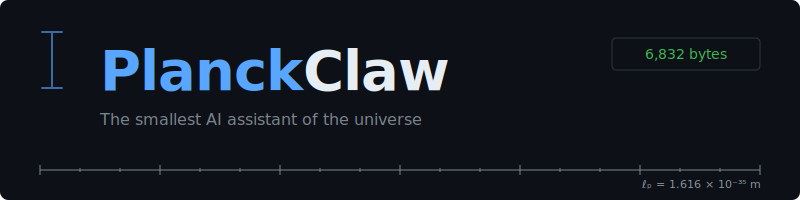

# PlanckClaw

<p align="center">
  
</p>

<p align="center">
  
  
  
  
  
  
</p>

An AI agent in ~7 KB of x86-64 assembly. No libc, no runtime, no allocator. Just Linux syscalls.

PlanckClaw is an autonomous agent that listens on Discord, talks to the Claude API, uses tools, and remembers things between sessions. It's not a chatbot — it's a real agent. When you ask it for the time or system status, it executes Linux syscalls (`clock_gettime`, `sysinfo`) and feeds the results back to the LLM through Claude's [tool use](https://docs.anthropic.com/en/docs/build-with-claude/tool-use) protocol. The core is a static binary compiled from ~2,300 lines of NASM assembly. It does zero networking; that part is delegated to shell scripts and standard Unix tools (`curl`, `websocat`, `jq`), composed through named pipes. Three processes, four FIFOs, one agent. That's it.

The entire runtime footprint (binary, shell scripts, config, soul file) is ~19 KB. That's the whole agent. It fits on a 1.44 MB floppy disk about 75 times.

Modern AI agent frameworks ship hundreds of megabytes of runtimes, package managers, and abstraction layers before a single token is generated. LangChain alone pulls in 400+ transitive dependencies. PlanckClaw asks: what if we stripped all of that away? What's the smallest thing that can still act?

***This is a thought experiment, not production-ready software.***

## quick start

```sh
make                          # build the ~7KB binary
cp config.env.example config.env
# edit config.env → add your Discord bot token, channel ID, Anthropic API key
./planckclaw.sh               # run
```

You'll need `nasm`, `curl`, `jq`, and `websocat` installed (see [install](#install) below). Send a message to your bot on Discord. It answers. It remembers.

## what is this

This is a thought experiment. A deliberate return to the Unix philosophy: do one thing, and do it well. The name comes from the [Planck length](https://en.wikipedia.org/wiki/Planck_length), the smallest meaningful scale in physics. PlanckClaw is the smallest meaningful AI agent we could build.

The agent binary does no networking. It reads from a pipe, writes to a pipe, and persists state to files. It builds JSON payloads for the Claude API by hand (no JSON library, just `stosb` and careful quoting). It parses API responses with a structural JSON walker written in x86-64. It escapes strings, manages conversation history, triggers memory compaction when history grows too long, and writes responses back out. When the LLM requests a tool call, the agent detects `stop_reason: "tool_use"`, executes the corresponding syscall, and sends the result back for a follow-up response — the full client-side tool execution loop, in assembly. All of this with raw `read`/`write`/`open`/`close`/`clock_gettime`/`sysinfo` syscalls. No malloc. No printf. No libc at all. The binary is fully static and has zero runtime dependencies.

Everything else is composed around it:

- `bridge_discord.sh` connects to the Discord Gateway via WebSocket, relays messages through FIFOs. ~180 lines of shell.
- `bridge_llm.sh` takes JSON payloads from a FIFO, `curl`s the Anthropic API, writes responses back. ~85 lines of shell.
- `planckclaw.sh` creates pipes, starts all three processes, cleans up on exit. ~75 lines of shell.

The total codebase is ~2,700 lines. The compiled binary is 7,008 bytes. It runs in ~200KB of RAM (mostly BSS buffers). There is no build system beyond a 6-line Makefile. There are no dependencies beyond what's already on your Linux box (plus `websocat`).

The point is not that you should write your agents in assembly. The point is that you *can*, that the core logic of an AI agent (read, think, act, remember, respond) is simple enough to fit in a few kilobytes of machine code. Everything else is ceremony.

## architecture

```
┌─────────────────────────────────────────────────────┐
│                   LINUX HOST                        │
│                                                     │
│  ┌───────────┐    FIFOs    ┌──────────────────┐     │
│  │           │ ─fifo_in──▶ │                  │     │
│  │  BRIDGE   │             │   AGENT           │     │
│  │  DISCORD  │ ◀─fifo_out─ │   (binary ~7KB  │     │
│  │           │             │    x86-64 asm)   │     │
│  │ (shell    │             ├──────────────────┤     │
│  │  script)  │             │                  │     │
│  │           │             │   BRIDGE LLM     │     │
│  └───────────┘             │   (shell script) │     │
│       │  ▲                 └──┬────────▲──────┘     │
│       │  │                    │        │            │
│       ▼  │             fifo_llm_req  fifo_llm_res  │
│   Discord API              │        │              │
│   (WebSocket + REST)       ▼        │              │
│                        Anthropic API               │
└─────────────────────────────────────────────────────┘
```

Three processes, four named pipes. The agent never touches the network. The bridges never touch the state. Clean separation.

- **Agent** (`planckclaw`): the ~7KB binary. Reads messages, builds API payloads, parses responses, executes tools, persists history and memory. Written in x86-64 assembly. No networking.
- **Bridge Discord** (`bridge_discord.sh`): connects to the Discord Gateway via WebSocket (`websocat`), relays user messages into `fifo_in`, sends agent responses from `fifo_out` to Discord via REST API.
- **Bridge LLM** (`bridge_llm.sh`): reads JSON payloads from `fifo_llm_req`, sends them to the Anthropic Messages API via `curl`, writes responses to `fifo_llm_res`. Retries on failure.

## tools

What makes PlanckClaw an *agent* rather than a chatbot is tool use. The agent registers two tools with the Claude API using the standard [tool use](https://docs.anthropic.com/en/docs/build-with-claude/tool-use) protocol:

| Tool | Syscall | What it returns |
|---|---|---|
| `get_time` | `clock_gettime(CLOCK_REALTIME)` | Current Unix timestamp |
| `system_status` | `sysinfo()` | Uptime, RAM total/free, 1-min load average, process count |

When the LLM decides it needs information, it returns `stop_reason: "tool_use"` instead of text. The agent detects this, executes the corresponding Linux syscall, formats the result, and sends it back in a `tool_result` message. The LLM then generates its final response using the real data.

The full loop — detect tool call, execute syscall, format result, re-send to API, parse final response — runs entirely in the ~7KB binary. No shell, no subprocess, no library. Just `syscall` instructions.

### limitations

These two tools are deliberately minimal. PlanckClaw is a thought experiment, not a framework. It doesn't have filesystem access, HTTP capabilities, or command execution — and that's by design. The point is to prove that the complete tool use protocol (request → detect → execute → respond) fits in a few kilobytes of machine code.

## memory

The agent maintains three files:

- `memory/soul.md`: system prompt, personality. You write this. The agent reads it on startup and injects it into every API call.
- `memory/history.jsonl`: full conversation log, append-only JSONL. One line per message, alternating user/assistant roles.
- `memory/summary.md`: compacted memory. When history exceeds `HISTORY_MAX` lines (default: 200), the agent sends old conversations to the LLM for summarization, keeps the last `HISTORY_KEEP` lines (default: 40), and stores the summary here. Next conversations include the summary as context.

This gives the agent long-term memory that survives restarts and grows without bound (thanks to compaction). Edit `soul.md` to change who the agent is. Delete `history.jsonl` and `summary.md` to wipe its memory.

## configuration

Environment variables in `config.env`:

| Variable | Description | Default |
|---|---|---|
| `DISCORD_BOT_TOKEN` | Discord bot token | (required) |
| `DISCORD_CHANNEL_ID` | Channel to listen on | (required) |
| `ANTHROPIC_API_KEY` | Anthropic API key | (required) |
| `PLANCKCLAW_DIR` | Memory directory | `./memory` |
| `HISTORY_MAX` | Lines before compaction | `200` |
| `HISTORY_KEEP` | Lines kept after compaction | `40` |

## install

**Build tools** (to compile the agent):

```sh
sudo apt install nasm binutils make    # Debian/Ubuntu
sudo dnf install nasm binutils make    # Fedora
```

**Runtime tools** (to run):

```sh
sudo apt install curl jq               # Debian/Ubuntu
```

Plus [websocat](https://github.com/vi/websocat), grab a binary from the releases page. It's a single static binary (the Unix way).

You'll also need a [Discord bot token](https://discord.com/developers/applications) with the Message Content intent enabled, and an [Anthropic API key](https://console.anthropic.com/).

## files

```
planckclaw/
├── planckclaw.asm         # the agent, ~2,300 lines of x86-64 NASM
├── Makefile               # nasm + ld → ~7KB binary
├── planckclaw.sh          # launcher, starts everything, cleans up on exit
├── bridge_discord.sh      # Discord ↔ FIFO bridge
├── bridge_llm.sh          # FIFO ↔ Anthropic API bridge
├── config.env.example     # config template
└── memory/
    ├── soul.md            # who the agent is (you write this)
    ├── history.jsonl      # conversation log (auto-generated)
    └── summary.md         # compacted memory (auto-generated)
```

## license

Public domain.
