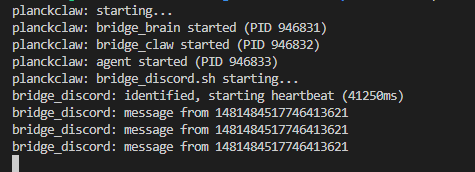

# PlanckClaw

<p align="center">
  
</p>

<p align="center">
  
  
  
  
  
  
</p>

*"Write programs that do one thing and do it well. Write programs to work together. Write programs to handle text streams, because that is a universal interface."* - Doug McIlroy, 1978

An AI agent in 6,832 bytes of x86-64 assembly. No libc, no runtime, no allocator. Just Linux syscalls.

PlanckClaw takes the Unix philosophy at its word. The agent is a single binary that does one thing: route. It reads messages from a pipe, writes prompts to a pipe, reads responses from a pipe, dispatches tool calls to a pipe. It doesn't know what platform it talks to, what LLM it thinks with, or what tools it has. Four processes, six named pipes, zero shared state. Composition over complexity. Pipes over protocols. `sh` over frameworks.

Modern AI agent frameworks ship hundreds of megabytes of runtimes, package managers, and abstraction layers before a single token is generated. LangChain alone pulls in 400+ transitive dependencies. PlanckClaw asks the question that [Worse is Better](https://www.dreamsongs.com/RiseOfWorseIsBetter.html) asked in 1989: what happens when you choose simplicity - in the interface *and* the implementation - above all else?

The entire runtime fits in ~23 KB. That's the binary, the bridges, the tools, the config. It fits on a 1.44 MB floppy disk 62 times. Run `make size` to verify.

***This is a thought experiment, not production-ready software.***

## features

- **Tool use**: the agent discovers available tools at each message and uses Claude's [tool_use](https://docs.anthropic.com/en/docs/build-with-claude/tool-use) protocol to call them. Ships with `get_time` and `system_status`.
- **Hot-reload extensibility**: add a tool by dropping a shell script in `claws/`. No restart, no recompilation, no config file.
- **Long-term memory**: conversation history persists across restarts in append-only JSONL.
- **Automatic compaction**: when history grows past a threshold, old conversations are summarized by the LLM and stored as compressed context.
- **Personality**: edit `memory/soul.md` to change who the agent is. Injected into every API call.
- **Swappable bridges**: CLI, Discord, or write your own. Pass as argument to the launcher.
- **Debug mode**: `PLANCKCLAW_DEBUG=1` dumps API payloads and HTTP status to stderr.
- **Zero dependencies**: the agent binary is fully static. No libc, no allocator, no runtime.

## quick start

Start with defaults : Anthropic LLM + CLI

```sh
git clone https://github.com/frntn/plankclaw.git && cd plankclaw
./configure                          # check prerequisites
make                                 # build the ~7KB binary
cp config.env.example config.env     # add your Anthropic API key
./planckclaw.sh                      # run in terminal mode by default
```

Extend using Discord bridge (require `jq` and `websocat`)

```sh
./planckclaw.sh bridge_discord.sh    # discuss via Discord (not CLI)
```

You'll need `nasm`, `curl`, `jq`, and `websocat` installed (see [install](#install) below).

<details>
<summary>screenshots (Discord + server logs)</summary>
<p>
  
  
</p>
</details>

## what is this

The name comes from the [Planck length](https://en.wikipedia.org/wiki/Planck_length), the smallest meaningful scale in physics. PlanckClaw is the smallest meaningful AI agent we could build: a return to [the Art of Unix Programming](http://www.catb.org/esr/writings/taoup/html/), where small sharp tools compose through text streams and the [Rule of Least Mechanism](http://www.catb.org/esr/writings/taoup/html/ch01s06.html#id2878263) governs every design decision.

The agent binary does no networking and executes no tools. It is a pure router (the `cat` of AI agents). Read a message from one pipe, ask another pipe what tools exist, build a prompt, write it to a third pipe, parse the response, dispatch tool calls, relay the answer. All of this with raw `read`/`write`/`open`/`close` syscalls. No `malloc`. No `printf`. No libc at all. The binary is fully static and has zero runtime dependencies.

Everything else is composed around it, the way [Doug McIlroy](https://en.wikipedia.org/wiki/Douglas_McIlroy) intended:

- `bridge_discord.sh`: Discord Gateway via WebSocket (~180 lines of `sh`)
- `bridge_cli.sh`: terminal interface (~40 lines of `sh`)
- `bridge_brain.sh`: `curl`s the Anthropic API (~90 lines of `sh`)
- `bridge_claw.sh`: tool discovery and dispatch (~50 lines of `sh`)
- `planckclaw.sh`: creates pipes, starts processes, cleans up (~90 lines of `sh`)

The total codebase is ~2,800 lines. The compiled binary is 6,832 bytes. It runs in ~200 KB of resident memory. There is no build system beyond a 6-line Makefile. The `./configure` is 30 lines of readable `sh`, not 10,000 lines of autoconf. No `cmake`. No `package.json`. Just `nasm`, `ld`, and `make`.

The point is not that you should write your agents in assembly. The point is that you *can*, that the core logic of an AI agent (read, think, act, remember, respond) is simple enough to fit in a few kilobytes of machine code. Everything else is ceremony.

## why it matters

The first question people ask is: *why assembly? what's the point?*

The point is not that you should write agents in assembly. The point is that the core logic of an AI agent is trivially small, and the bloat of modern frameworks is accidental complexity, not essential complexity. PlanckClaw makes this visible by stripping everything away.

But the extreme minimalism also opens real doors:

- **Embedded and IoT**: 7KB binary, 200KB RSS. It runs on a Raspberry Pi Zero, an ESP32, a $1 microcontroller. An AI agent on a sensor, a drone, a wearable, anywhere there's a network link to an LLM API.
- **Serverless cold start**: a static binary with zero dependencies starts in microseconds. No interpreter warmup, no package loading. Ideal for FaaS where cold start latency is the bottleneck.
- **Multi-tenant scale**: 10,000 concurrent agent instances at 200KB each = 2GB total. The same workload in Python at 200MB each = 2TB. That's a 1000x difference in infrastructure cost.
- **Security surface**: zero dependencies means zero transitive CVEs, zero supply chain attack vectors. The entire binary is auditable by a single person. Relevant for air-gapped, military, or industrial environments.
- **Faster than interpreted**: no GC pauses, no JIT warmup, fits in L1 cache. The agent layer adds microseconds of latency. The bottleneck is always the API call (1-10s), never the agent.

None of this matters if the architecture is a dead end. But PlanckClaw's pipe-based design means the agent binary never changes: new tools, new bridges, new LLM providers are all shell scripts composed around a fixed core. The core stays under 8KB. Forever.

### how it compares

| Feature | OpenClaw 🤖 | NullClaw 🦀 | PicoClaw ⚡ | PlanckClaw 🤏 |
|---|---|---|---|---|
| Language | TypeScript / Node.js | Zig | Go | x86-64 Assembly |
| Execution Style | Full Service (Ext. Deps) | Static Binary | Static Binary | Static Binary (no libc) |
| Resource Usage | High (Full Runtime) | Near Zero (~1MB) | Ultra-Low (<10MB) | Near Zero (~200KB) |
| Startup Speed | Seconds (~Node startup) | Instant (<2ms) | Fast | Instant (<1ms) |
| Hardware Target | PC / Server / Cloud | Edge / Open ($5) Hardware | Embedded / IoT ($10) | Embedded / IoT ($1) |

## architecture

```
    ┌───────────────────┐
    │     Discord       │
   ┌┤    Connector      │
  ┌┤└──────────────────┬┘
  │└──────────────────┬┘
  └────┬──────────▲───┘
       │          │
   ┌───▼──────────┴───┐
   │  BRIDGE INTERACT │
   │  (shell script)  │
   └───┬──────────▲───┘
       │          │
       │          │
   ┌───▼──────────┴───┐                                   ┌───────────────────┐
   │                  │      ┌──────────────────┐        ┌│      time.sh      │
   │      AGENT       ├──────►   BRIDGE TOOL    ├─────► ┌┤└───────────────────┘
   │  6.8KB x86-64    ◄──────┤  (shell script)  ◄───── ┌┤└──────────────────┬┘
   │                  │      └──────────────────┘      │└──────────────────┬┘
   └───┬──────────▲───┘                                └───────────────────┘
       │          │
       │          │
   ┌───▼──────────┴───┐
   │   BRIDGE BRAIN   │
   │  (shell script)  │
   └───┬──────────▲───┘
       │          │
       │          │
   ┌───▼──────────┴────┐
   │   Anthropic API   │
  ┌┤     Connector     │
 ┌┤└──────────────────┬┘
 │└──────────────────┬┘
 └───────────────────┘
```

Four processes, six named pipes. The agent never touches the network. The bridges never touch the state. Clean separation.

- **Agent** (`planckclaw`): the ~7KB binary. Pure router: reads messages, discovers tools, builds API payloads, parses responses, dispatches tool calls, persists history and memory. Written in x86-64 assembly. No networking, no tool execution.
- **Bridge Interact** (`bridge_discord.sh` or `bridge_cli.sh`): swappable. `bridge_discord.sh` connects to Discord via WebSocket. `bridge_cli.sh` provides a terminal interface. Pass as argument to `planckclaw.sh`.
- **Bridge Brain** (`bridge_brain.sh`): reads JSON payloads from `brain_in`, sends them to the Anthropic Messages API via `curl`, writes responses to `brain_out`. Retries on failure.
- **Bridge Claw** (`bridge_claw.sh`): scans `claws/*.sh` for tool definitions on `__list_tools__` (builtins, zero fork), dispatches tool calls to matching claw scripts. Hot-reload: add/remove a file, the next message sees the change.

## tools

What makes PlanckClaw an *agent* rather than a chatbot is tool use. At each message, the agent asks the claw bridge for available tools via the `__list_tools__` discovery protocol and injects them into the Claude API request using the standard [tool use](https://docs.anthropic.com/en/docs/build-with-claude/tool-use) protocol.

PlanckClaw ships with two default claws in the `claws/` directory:

| Tool | Claw file | What it returns |
|---|---|---|
| `get_time` | `claws/time.sh` | Current Unix timestamp |
| `system_status` | `claws/system.sh` | Uptime, RAM total/free, 1-min load average, process count |

When the LLM decides it needs information, it returns `stop_reason: "tool_use"` instead of text. The agent detects this, dispatches the call to the claw bridge via FIFO, and sends the result back in a `tool_result` message. The LLM then generates its final response using the real data.

### extensibility

Adding a new tool is simple, just drop a file in `claws/`:

```sh
#!/bin/sh
#TOOLS:{"name":"my_tool","description":"What it does","input_schema":{"type":"object","properties":{}}}

case "$1" in
    my_tool) printf 'result here' ;;
esac
```

Make it executable (`chmod +x`) and you're done. The claw bridge scans `claws/*.sh` at each message using shell builtins (zero fork for discovery). No recompilation, no config file, no restart needed — hot-reload is built in.

## limitations

**Fixed-size buffers**: no `malloc`, no `brk`, no `mmap`. All buffers are allocated in BSS at compile time. If a message or response exceeds its buffer, it is silently truncated (no crash, no error). In practice these limits cover most use cases, but they are real constraints worth knowing:

| Buffer | Size | What it holds |
|---|---|---|
| User message | 4 KB | Incoming message from bridge |
| API request | 64 KB | Full JSON payload sent to the LLM |
| API response | 64 KB | Raw JSON response from the LLM |
| Extracted response | 8 KB | Text content parsed from the response |
| System prompt | 8 KB | `memory/soul.md` content |
| Conversation history | 32 KB | `memory/history.jsonl` (tail) |
| Tool result | 4 KB | Output from a single tool call |

**Minimal default tools**: PlanckClaw ships with only `get_time` and `system_status`. The architecture supports any tool (filesystem access, HTTP requests, command execution) by adding a claw file, but out of the box it is deliberately minimal.

**Linux only**: raw x86-64 syscalls, no portability layer. No macOS, no Windows, no ARM.

**This is a thought experiment, not production-ready software.**

## memory

The agent maintains three files:

- `memory/soul.md`: system prompt, personality. You write this; the agent reads it on startup and injects it into every API call.
- `memory/history.jsonl`: full conversation log, append-only JSONL. One line per message, alternating user/assistant roles.
- `memory/summary.md`: compacted memory. When history exceeds `HISTORY_MAX` lines (default: 200), the agent sends old conversations to the LLM for summarization, keeps the last `HISTORY_KEEP` lines (default: 40), and stores the summary here. Next conversations include the summary as context.

This gives the agent long-term memory that survives restarts and grows without bound (thanks to compaction). Edit `soul.md` to change who the agent is. Delete `history.jsonl` and `summary.md` to wipe its memory.

## configuration

Environment variables in `config.env`:

| Variable | Description | Default |
|---|---|---|
| `DISCORD_BOT_TOKEN` | Discord bot token | (required for Discord) |
| `DISCORD_CHANNEL_ID` | Channel to listen on | (required for Discord) |
| `ANTHROPIC_API_KEY` | Anthropic API key | (required) |
| `PLANCKCLAW_DIR` | Memory directory | `./memory` |
| `HISTORY_MAX` | Lines before compaction | `200` |
| `HISTORY_KEEP` | Lines kept after compaction | `40` |
| `PLANCKCLAW_DEBUG` | Enable debug logging (`1` = on) | `0` |

## install

**Build tools** (to compile the agent):

```sh
sudo apt install nasm binutils make    # Debian/Ubuntu
sudo dnf install nasm binutils make    # Fedora
```

**Runtime tools** (to run):

```sh
sudo apt install curl jq               # Debian/Ubuntu
```

Plus [websocat](https://github.com/vi/websocat), grab a binary from the releases page. It's a single static binary (the Unix way).

You'll also need a [Discord bot token](https://discord.com/developers/applications) with the Message Content intent enabled, and an [Anthropic API key](https://console.anthropic.com/).

## files

```
planckclaw/
├── planckclaw.asm         # the agent, ~2,300 lines of x86-64 NASM
├── configure              # prerequisite check (30 lines of sh, not autoconf)
├── Makefile               # nasm + ld → ~7KB binary
├── planckclaw.sh          # launcher, starts everything, cleans up on exit
├── bridge_discord.sh     # Discord ↔ FIFO interaction bridge
├── bridge_cli.sh          # Terminal ↔ FIFO interaction bridge
├── bridge_brain.sh        # FIFO ↔ Anthropic API brain bridge
├── bridge_claw.sh         # FIFO ↔ claw router (discovery + dispatch)
├── config.env.example     # config template
├── claws/
│   ├── time.sh            # claw: get_time
│   └── system.sh          # claw: system_status
└── memory/
    ├── soul.md            # who the agent is (you write this)
    ├── history.jsonl      # conversation log (auto-generated)
    └── summary.md         # compacted memory (auto-generated)
```

## license

MIT. See [LICENSE](LICENSE).
